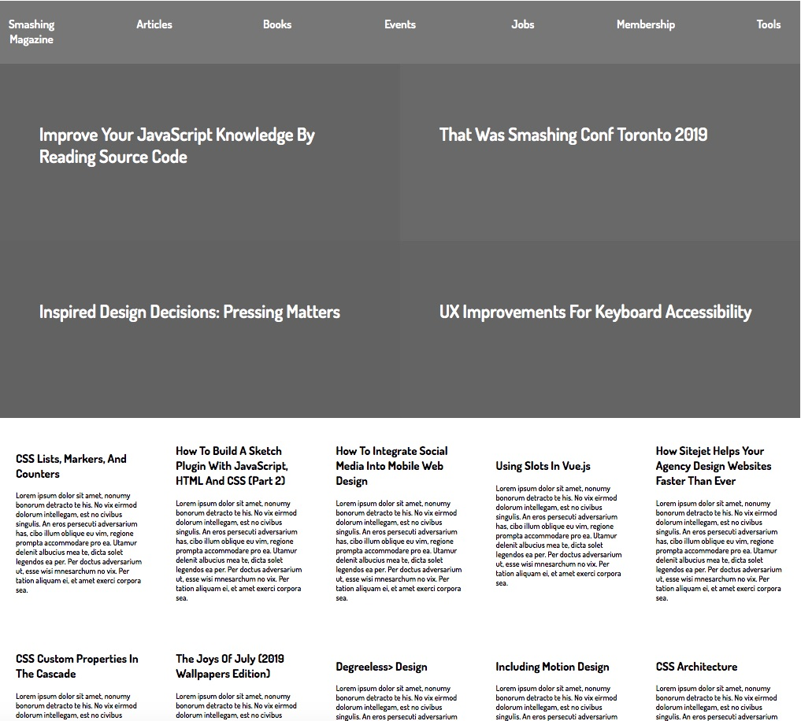

Microverse curiculum 5th collaborative project

# Design and UX

## # Design-Teardown

In this simple project, We were breaking apart the website for a popular design magazine with which we are probably familiar by now – Smashing Magazine. The goal for this exercise is to start training ourselves to think in terms of visual hierarchy, typography and design principles.

Used:
 * CSS FlexBox
 * HTML5
 * CSS Grid
 
## Authors

 * Neto daniel Zinga https://github.com/dannyclever
 * Nick Haralampopoulos https://github.com/macnick

## Screenshot

 

## The Website

Follow the link to acess to the Website: https://macnick.github.io/NYT-article/
